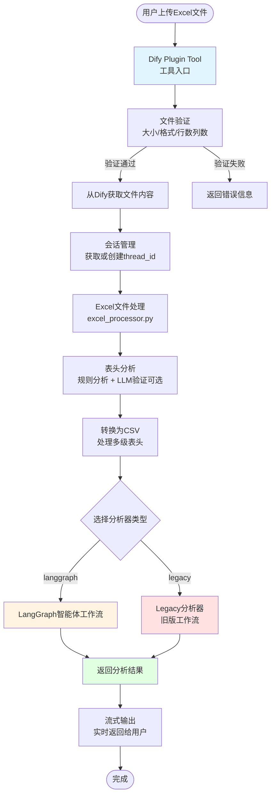
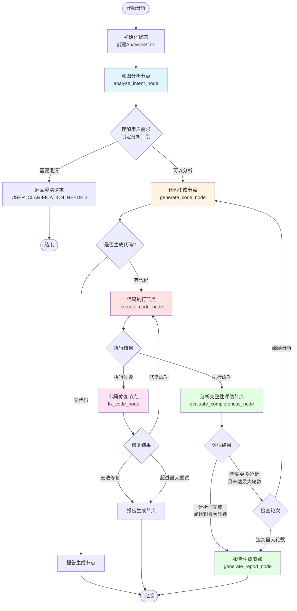
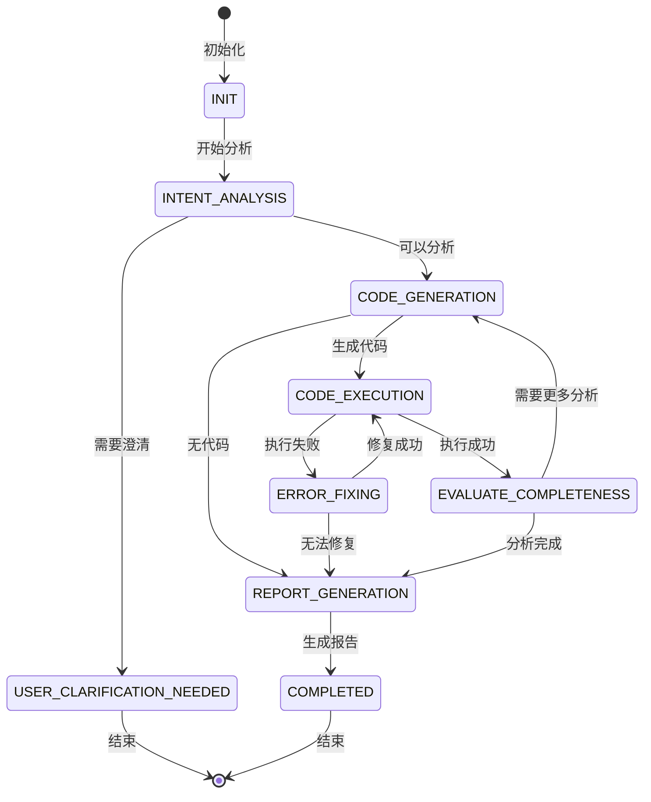
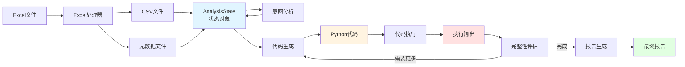
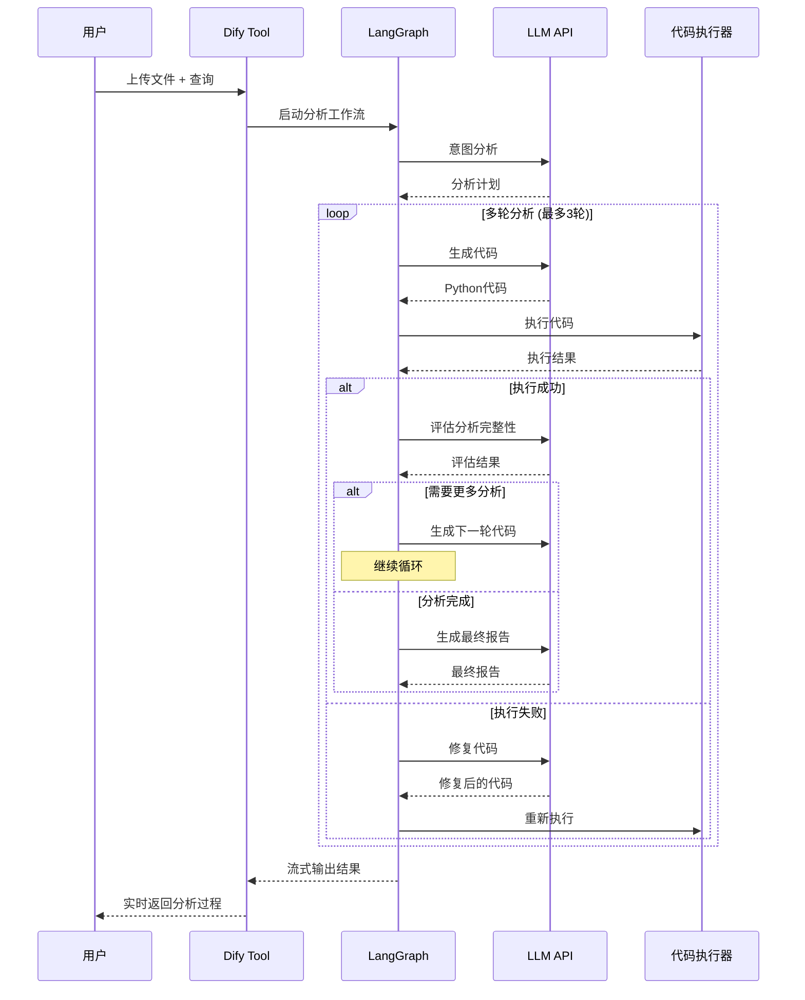
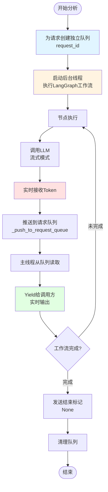

# 项目工作流程图

## 1. 整体架构流程



## 2. LangGraph 智能体详细工作流程



## 3. LangGraph 节点详细说明

### 3.1 意图分析节点 (analyze_intent_node)

**职责**：理解用户需求，制定分析计划

**输入**：
- CSV文件路径
- 数据预览
- 列名和元数据
- 用户查询

**处理**：
1. 调用LLM分析用户意图
2. 判断是否需要澄清
3. 确定分析类型（simple/overview/specific）
4. 生成分析任务列表

**输出**：
- 分析计划
- 首个分析任务
- 或澄清请求

### 3.2 代码生成节点 (generate_code_node)

**职责**：根据分析任务生成Python代码

**输入**：
- 当前分析任务
- 数据信息
- 之前的分析结果（多轮分析时）

**处理**：
1. 构建代码生成Prompt
2. 调用LLM生成代码
3. 从响应中提取Python代码块

**输出**：
- Python代码
- 或直接进入报告生成（无代码时）

### 3.3 代码执行节点 (execute_code_node)

**职责**：在安全环境中执行生成的代码

**输入**：
- Python代码
- 工作空间目录

**处理**：
1. 添加matplotlib中文支持
2. 在隔离环境中执行代码
3. 捕获执行输出和错误
4. 检测生成的文件

**输出**：
- 执行结果（成功/失败）
- 执行输出内容
- 错误信息（如有）

### 3.4 代码修复节点 (fix_code_node)

**职责**：当代码执行失败时，调用LLM修复代码

**输入**：
- 原始代码
- 错误信息
- 重试次数

**处理**：
1. 构建修复Prompt（包含错误信息）
2. 调用LLM生成修复后的代码
3. 提取修复后的代码

**输出**：
- 修复后的代码（返回执行节点）
- 或无法修复（进入报告生成）

**限制**：最大重试3次

### 3.5 分析完整性评估节点 (evaluate_completeness_node)

**职责**：评估当前分析是否充分回答了用户问题

**输入**：
- 用户原始查询
- 当前分析结果
- 已完成的任务
- 当前轮次

**处理**：
1. 调用LLM评估分析完整性
2. 判断是否需要更多分析
3. 如果需要，生成下一轮分析方向

**输出**：
- 需要更多分析 → 返回代码生成节点（循环）
- 分析已完成 → 进入报告生成

**限制**：默认最大3轮分析

### 3.6 报告生成节点 (generate_report_node)

**职责**：综合所有分析结果，生成最终报告

**输入**：
- 所有轮次的分析结果
- 用户原始查询
- 分析类型

**处理**：
1. 整合所有分析结果
2. 调用LLM生成综合报告
3. 格式化输出

**输出**：
- 最终分析报告
- 完成状态

## 4. 状态流转图



## 5. 数据流图



## 6. 多轮分析循环机制



## 7. 流式输出机制



## 8. 关键技术点

### 8.1 多线程安全
- 每个请求使用独立的队列（`request_id`）
- 使用线程锁保护共享资源
- 后台线程执行工作流，主线程处理流式输出

### 8.2 状态管理
- 使用 `TypedDict` 定义状态结构
- 使用 `Annotated` 实现列表追加
- 状态在节点间自动传递和更新

### 8.3 错误处理
- 代码执行失败 → 自动修复（最多3次）
- 无法修复 → 生成报告（包含错误信息）
- 超时保护 → 默认360秒超时

### 8.4 多轮分析
- 自动评估分析完整性
- 支持最多3轮分析（可配置）
- 每轮分析基于前一轮结果

### 8.5 流式输出
- LLM响应实时传递
- 支持打字机效果
- 节点完成信息实时反馈

## 9. 配置参数

### 9.1 必选配置
- `analysis_api_url`: 数据分析API地址
- `analysis_model`: 分析模型名称

### 9.2 可选配置
- `llm_api_key`: LLM API密钥（用于表头验证）
- `llm_base_url`: LLM Base URL
- `llm_model`: LLM模型名称
- `analyzer_type`: 分析器类型（langgraph/legacy）
- `max_analysis_rounds`: 最大分析轮数（默认3）
- `analysis_timeout`: 分析超时时间（默认360秒）
- `debug_print_execution_output`: 是否打印执行结果

## 10. 文件结构说明

```
dify-plugin-data-analyzer-langgrpah/
├── main.py                          # 插件入口
├── tools/
│   └── dify-plugin-data-analyzer.py # Dify工具实现
├── provider/
│   └── dify-plugin-data-analyzer.py # 提供者实现
├── core/
│   ├── excel_analyze_api.py         # 核心API（入口）
│   ├── excel_processor.py          # Excel文件处理
│   ├── analyzer/
│   │   ├── graph.py                 # LangGraph工作流图
│   │   ├── state.py                 # 状态定义
│   │   └── prompts.py               # 提示词模板
│   ├── storage.py                   # 存储管理
│   └── utils.py                     # 工具函数
└── workspace/                        # 工作空间（文件存储）
```

